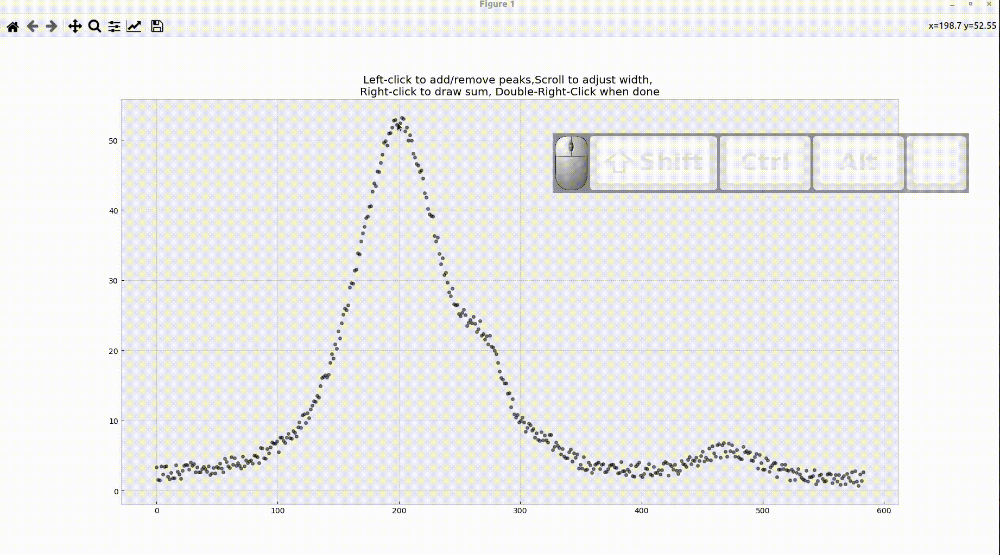
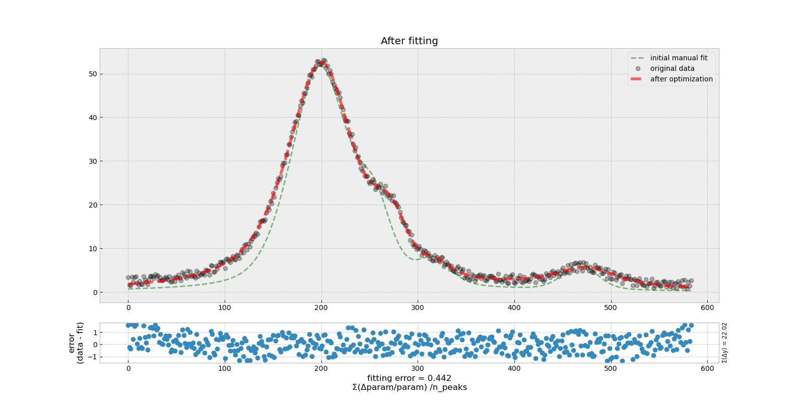
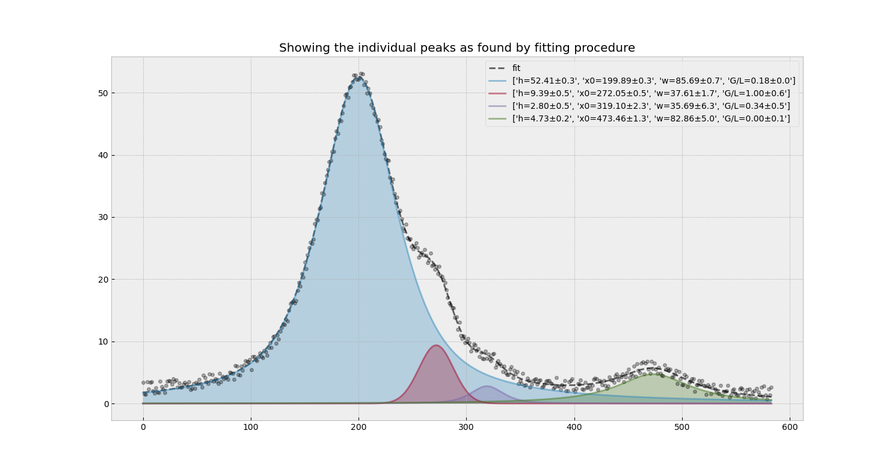

# SMfit tool
The tool whose aim is to facilitate the fitting of the (experimental) curve with multiple (overlapping) peaks.

    

        
<b>Baseline !</b> 
   
    Your curve should be baseline-corrected.
    If that is not the case, you may want to use the `baseline_als` function
    to remove the baseline first. You'll find this function in `utilities.py`.
    All you need to do is something like:
    <pre>y -= ut.baseline_als(y)</pre>
    (After you have loaded your data) to create a new, baseline substracted, y.
    

This procedure allows you to manually determine reasonable initial parameters to pass on to scipy optimize module.

## **Instructions:** 
1. Left-click on the graph to add one pseudo-voigt profile at a time.
    -  Once the profile added, you can modify its width by scrolling the mouse wheel.
2. Repeat the procedure as many times as needed to account for all the peaks you beleive are present.
- Right-clicking any time will draw the sum of all the present profiles you added up to that moment.
- Left clicking on the top of existing peak erases it.
3. Press "Enter" or right doubleclick to end 

    
Attention!

    This step is very important. You should be aware that there could be <b>many</b> different combinations of peaks that can fit you data equally well. This is why your expert (yes, that's you) input is important. Other thing of paramount importance is to set the limits on the fitting parameters (restrain the space whithin which the algorithm searches for <b>a</b> minimum).

### Afther this step, the script should optimize the initial parameters you thus provided
nothing else to do, but admire the view(s)

